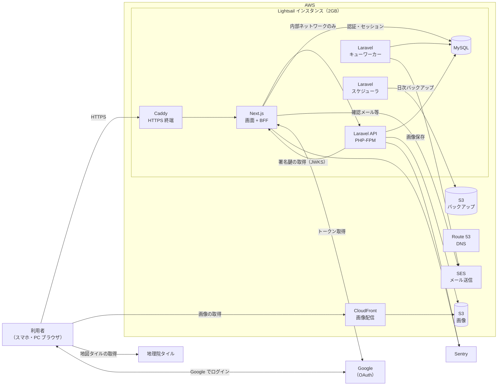
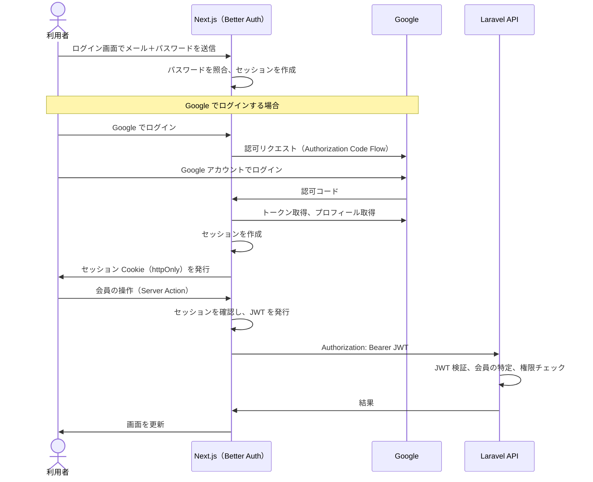
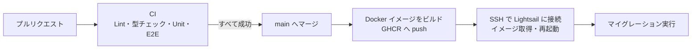
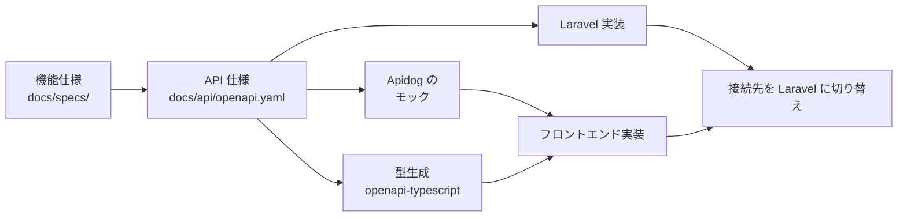

# アーキテクチャ・技術選定書：城将（仮）第一フェーズ

| 項目 | 内容 |
|---|---|
| バージョン | 1.0（初版） |
| 作成日 | 2026-10-05 |
| ステータス | 確定 |
| 関連ドキュメント | `constitution.md`、`requirements.md` |

このドキュメントは、第一フェーズで「どう作るか」を定めます。技術スタック、システム構成、ディレクトリ構成、外部サービスと、それぞれを選んだ理由を記録します。個々の判断の詳しい経緯は `docs/adr/` に残します。

---

## 1. 設計の前提

`constitution.md` と `requirements.md` から、アーキテクチャに影響する前提を抜き出します。

| 前提 | 出典 | 設計への影響 |
|---|---|---|
| 月額1,000円以内が目標、3,000円が上限 | 憲章 7.3、NFR-10 | サーバーは1台に集約し、マネージドサービスは無料枠の範囲で使う |
| 学習が最優先（Next.js フルスタック、Laravel DDD、Better Auth、AWS、テスト自動化） | 憲章 4.1、8.1 | 学習目標の技術を省略しない構成にする |
| セキュリティと個人情報の保護は必ず守る | 憲章 8.1、NFR-05 | トークンをブラウザに置かない。API を外部に公開しない |
| 一人で無理なく運用し続ける | 憲章 8.2 | 構成要素を増やしすぎない。デプロイとバックアップは自動化する |
| 規模は初年度で会員数百人、城200件、武将100人程度 | NFR-09 | 1台構成で十分。検索エンジンやキャッシュサーバーは入れない |
| 数時間の停止は許容 | NFR-03 | 冗長化はしない。デプロイ時の数秒の停止も許容する |
| 第二フェーズで一部機能を Go に切り出す | 憲章 6.3 | Go のサービスを追加しやすいディレクトリ構成にする |

---

## 2. 技術スタック

### 2.1 憲章で決定済みの技術

| 領域 | 採用技術 | 用途・方針 |
|---|---|---|
| フロントエンド | Next.js（App Router） | 画面の描画と BFF（後述）を担う |
| ランタイム・パッケージ管理 | Bun | パッケージ管理とスクリプト実行に使う。本番の実行環境は Node.js とする（2.3 を参照） |
| Lint・Formatter | Biome | フロントエンドの TypeScript／CSS に適用する |
| フォーム・バリデーション | react-hook-form、zod | zod のスキーマはフォームとサーバー側（Server Actions）の両方で使う |
| 状態管理 | zustand | 地図の表示状態など、クライアント側の UI 状態に限定して使う。サーバーのデータは持たない |
| UI コンポーネント | shadcn/ui | コードをプロジェクトに取り込む方式のため、見た目（DESIGN.md のトークン）とアクセシビリティの調整を自分で行える。`components/ui/` に置く（10章） |
| 地図 | mapcn | MapLibre GL ベースの地図コンポーネント。背景地図は地理院タイル（5章） |
| バックエンド | Laravel（DDD） | Web API。外部には公開せず、Next.js からのみ呼ばれる |
| データベース | MySQL | |
| 認証 | Better Auth | Next.js に組み込み、認証（本人確認）とセッション管理を担う。認可（権限）は Laravel で管理する（6章） |
| コンテナ | Docker、Docker Compose | ローカルと本番で同じ構成を使う |
| インフラ | AWS | Lightsail を中心に、S3・CloudFront・SES・Route 53 を使う |

### 2.2 追加で採用する技術

憲章 7.1 では「追加が必要な場合は理由を `architecture.md` に記録してから採用する」と定めています。以下は、その記録です。

| 技術 | 用途 | 採用理由 |
|---|---|---|
| Tailwind CSS | スタイリング | shadcn/ui と mapcn が前提としているため |
| MapLibre GL JS | 地図描画エンジン | mapcn が内部で使用する。ピンのクラスタリング（AC-01-3）にも使う |
| Caddy | リバースプロキシ、HTTPS | 証明書の取得と更新が自動で、設定が短い。Nginx＋Certbot より運用の手間が少ない |
| Terraform | AWS リソースのコード管理（IaC） | インフラの学習目標に合い、構成をリポジトリで公開・再現できる |
| mysql2 | Better Auth から MySQL への接続 | Better Auth が MySQL を使うときの接続ドライバー（7.1） |
| JWT 検証ライブラリ（PHP） | Laravel でのアクセストークン検証 | Better Auth（JWT プラグイン）が公開する JWKS で署名を検証するため。Better Auth の署名方式の初期値は EdDSA のため、対応するライブラリを実装時に選び、ADR に残す |
| openapi-typescript | OpenAPI から TypeScript の型を生成 | `docs/api/openapi.yaml` と実装の型を一致させるため（SDD の原則） |
| Node.js | Next.js の本番サーバー、Playwright の実行環境 | 2.3 を参照 |
| Vitest、React Testing Library、jsdom | フロントエンドの Unit テスト | Next.js の公式ドキュメントに導入手順があり、React コンポーネントのテストの情報が豊富。`bun test` で同等のことをするには追加の設定が必要で、つまずいたときに調べる手間が大きい |
| Playwright | E2E テスト | NFR-12 の E2E テストのため。Chrome・Safari（WebKit）の両方で動かせる。Node.js 上で実行する |
| Apidog | API 仕様の編集、モックサーバー | フロントエンドを先に開発するため、Laravel の完成前に API の代わりとなるモックが必要。OpenAPI と Git リポジトリを同期できる（9.4） |
| Pest | Laravel の Unit テスト、Feature テスト、アーキテクチャテスト | Laravel の新規プロジェクトで選べる標準のテストフレームワーク。アーキテクチャテスト（`arch()`）でレイヤーの依存の向きを自動で検査できる（`conventions/PHP-Laravel.md`） |
| Laravel Pint、Larastan | PHP の整形、静的解析 | Biome は PHP を扱えないため、バックエンドの「最低限のコード品質」を担保する |
| Intervention Image | 画像の Exif 削除、リサイズ | NFR-05 の「位置情報などの Exif 削除」のため |
| Sentry SDK | エラー監視 | NFR-11 のため（8章） |
| Linear | タスク管理 | GitHub 連携でブランチ・PR と Issue を自動で紐づけられ、見積もりと実績の記録にも使える。開発の管理ツールでありアプリケーションには組み込まない（`conventions/branch-commit.md`） |

### 2.3 注意点

- パッケージ管理とスクリプト実行は Bun、本番の Next.js と Playwright の実行は Node.js とする（憲章 7.1）。Node.js の挙動に依存するツールを Bun 上で動かすと、互換性の問題で調査に時間を取られるおそれがあり、「速度」（憲章 8.1）を損なうため。Node.js は Docker イメージの中でのみ使い、開発時の操作（`bun install`、`bun run`）は Bun に統一する。
- mapcn は MapLibre の Web Worker を外部 CDN（unpkg）から読み込む初期設定になっている。CSP（Content Security Policy）を厳しく設定するため、Worker ファイルは自前で配信するように変更する。

### 2.4 テストの分担

`docs/testing.md` で詳細を定めます。ここではツールの使い分けのみを定めます。

| 対象 | テスト方法 |
|---|---|
| zod スキーマ、ユーティリティ関数、カスタムフック | Vitest |
| クライアントコンポーネント（フォームなど） | Vitest＋React Testing Library |
| 非同期の Server Components | Vitest では扱いにくいため、Playwright の E2E で確認する |
| 地図（MapLibre） | jsdom では WebGL が動かないため、Playwright の E2E で確認する |
| Laravel のドメイン層 | Pest。必須（憲章 8.5） |
| 主要なユーザーの流れ | Playwright（NFR-12） |

---

## 3. システム構成

### 3.1 構成図



### 3.2 構成要素

| 構成要素 | 配置 | 役割 |
|---|---|---|
| Caddy | Lightsail（コンテナ） | HTTPS の終端、Next.js へのリバースプロキシ、セキュリティヘッダーの付与 |
| Next.js | Lightsail（コンテナ） | 画面の描画、BFF（Laravel への中継とアクセストークンの付与）、認証とセッション管理（Better Auth） |
| Laravel API | Lightsail（コンテナ） | ドメインロジック、認可、データの読み書き。**インターネットには公開しない** |
| キューワーカー | Lightsail（コンテナ） | メール送信、通知の作成など時間のかかる処理。Laravel と同じイメージで起動する |
| スケジューラ | Lightsail（コンテナ） | DB バックアップなどの定期処理。Laravel と同じイメージで起動する |
| MySQL | Lightsail（コンテナ） | データベース。Laravel 用と Better Auth 用のデータベースを分けて置く（7.1）。データはホスト側のボリュームに保存する |
| S3（画像） | AWS | 城・武将の画像、会員の写真を保存する |
| CloudFront | AWS | S3 の画像を配信する。S3 への直接アクセスは禁止する（OAC を使用） |
| S3（バックアップ） | AWS | DB のダンプを保存する |
| SES | AWS | 通知メール（Laravel）、確認メール・パスワード再設定メール（Better Auth）の送信 |
| Route 53 | AWS | ドメインの DNS 管理 |
| Google（OAuth） | 外部サービス | Google アカウントでの会員登録・ログイン。Google Cloud で OAuth クライアントを作成する |
| 地理院タイル | 国土地理院 | 背景地図。ブラウザから直接取得する |
| Sentry | 外部 SaaS | フロントエンド・バックエンドのエラー監視 |

### 3.3 Lightsail を選んだ理由

| 候補 | 評価 |
|---|---|
| **Lightsail（採用）** | データ転送量やストレージを含めてほぼ定額で、費用の見通しが立てやすい。月額の制約を管理しやすい |
| EC2 | EBS、パブリック IPv4、データ転送量が別料金になり、月額が読みにくい。VPC 等の学習にはなるが、第一フェーズでは費用を優先する |
| ECS Fargate＋RDS | 構成としては理想的だが、RDS だけで月額の上限に近づく。利用者が増えたときの移行先とする（12章） |
| Vercel＋AWS | Next.js の運用は楽になるが、学習目標（AWS でのインフラ構築）から外れ、構成も分散する |

プランは**2GB**とします。Next.js・PHP-FPM・MySQL を同居させるため、1GB では余裕がないためです。メモリ配分の目安は次のとおりです（実測して調整する）。

| プロセス | 目安 |
|---|---|
| OS・Docker | 300MB |
| MySQL（InnoDB バッファプール 256MB） | 500MB |
| Next.js | 300MB |
| PHP-FPM（ワーカー数を制限） | 300MB |
| キューワーカー、スケジューラ | 150MB |
| Caddy | 50MB |
| 余裕 | 約400MB |

あわせて、スワップ領域を 1〜2GB 設定し、一時的なメモリ不足でプロセスが落ちないようにします。ビルドはサーバー上では行わず、GitHub Actions でビルドしたイメージを使います（9章）。

---

## 4. Next.js と Laravel の役割分担（BFF 方式）

### 4.1 方式

ブラウザは Next.js とだけ通信し、Laravel API は Next.js のサーバー側からのみ呼び出します（BFF：Backend for Frontend）。

| 処理 | 実装場所 | Laravel の呼び方 |
|---|---|---|
| 城・武将の一覧と詳細、公開プロフィールの表示 | Server Components | 認証なしで呼ぶ。結果は Next.js のデータキャッシュに載せる |
| 地図のピンデータ（全城） | Server Components で取得し、地図コンポーネントに渡す | 認証なし。200件程度なので一括で取得する |
| 訪問記録の登録、情報提供など会員の操作 | Server Actions | セッションをもとに Better Auth で短時間だけ有効なアクセストークン（JWT）を発行し、Authorization ヘッダーに付ける |
| 管理画面の操作 | Server Actions | 同上。権限チェックは Laravel が行う |
| ファイルのアップロード（写真、CSV） | Route Handlers | 同上。Next.js はファイルを中継するだけ |

### 4.2 採用理由

| 観点 | ブラウザから直接 Laravel を呼ぶ方式 | BFF 方式（採用） |
|---|---|---|
| アクセストークンの置き場所 | ブラウザ（JavaScript から読める） | サーバー側のみ。ブラウザには httpOnly Cookie のセッションだけ |
| XSS が起きたときの被害 | トークンを盗まれる可能性がある | トークン自体は盗まれない |
| Laravel API の公開 | インターネットに公開する必要がある | 内部ネットワークに閉じられる |
| CORS 設定 | 必要 | 不要（同一オリジン） |
| 一覧・詳細の表示速度（NFR-01） | クライアント取得では LCP が遅くなりがち | サーバー側で取得して描画できる |
| 学習目標との合致 | Next.js はほぼ画面のみ | Next.js でのフルスタック開発に合う |
| 実装の手間 | 少ない | Next.js 側に中継処理が必要 |

ソースコードを公開しており、憲章でセキュリティを最優先事項にしているため、トークンをブラウザに置かない BFF 方式を採用します。

### 4.3 注意点

- Server Actions の受信サイズの上限は初期設定で1MBのため、ファイルのアップロードは Route Handlers で受ける。上限は5MB（NFR-05）＋余裕とする。
- 管理画面でデータを更新したら、Server Actions の中で Next.js のキャッシュを無効化（`revalidateTag`）し、公開画面に反映する。
- Laravel は Next.js から呼ばれる前提でも、**すべてのリクエストでトークン検証と権限チェックを行う**。Next.js を信頼して検証を省略しない。

---

## 5. 地図

### 5.1 構成

| 項目 | 内容 |
|---|---|
| 地図コンポーネント | mapcn（MapLibre GL JS） |
| 背景地図 | 地理院タイル（淡色地図）。ピンを目立たせるため淡色地図を第一候補とし、標準地図も比較する |
| タイル URL の例 | `https://cyberjapandata.gsi.go.jp/xyz/pale/{z}/{x}/{y}.png` |
| ピンのクラスタリング | MapLibre の GeoJSON ソースのクラスタ機能（AC-01-3） |
| ピンの区別 | 100名城・続100名城、訪問済み・未訪問を、色に加えて形やアイコンで区別する（AC-01-4、AC-12-1、NFR-07） |
| 出典表示 | 地図の右下に「出典：国土地理院（地理院タイル）」を表示し、地理院タイル一覧ページへリンクする |

地図はブラウザでのみ動くため、地図コンポーネントはクライアントコンポーネントとし、サーバー側では描画しません。地図を操作できない利用者のために、同じ情報を城一覧と検索でたどれるようにします（NFR-07）。

### 5.2 選定理由と比較

| 候補 | 費用・利用条件 | 評価 |
|---|---|---|
| **地理院タイル（採用）** | 国土地理院コンテンツ利用規約に基づき、出典の明示で利用できる。API キー不要 | 日本の地名が日本語で正確に表示される。ラスタタイルを MapLibre に設定するだけなので、実装の手間は小さい |
| mapcn の初期設定（CARTO Basemaps） | 商用利用には CARTO の Enterprise ライセンスが必要。非商用でも無料なのは CARTO の規約で認められた範囲に限られる | 実装の手間は最小。ただし第二フェーズで決済（サブスクリプション）を入れると商用利用にあたるため、長期的には使い続けにくい |
| OpenFreeMap（OpenStreetMap ベース） | 無料・API キー不要とされる。OpenStreetMap の帰属表示が必要 | 地理院タイルが使えなかった場合の代替候補。日本語ラベルの表示状況を要確認 |

### 5.3 要確認：地理院タイルの承認申請

国土地理院の承認申請 Q&A では、ウェブサイトへの地図の挿入は原則として申請不要とされていますが、**ウェブサイトのメインコンテンツが地図である場合は例外**とされています。本サービスはトップページが地図であるため、この例外にあたり、測量法に基づく承認申請が必要になる可能性があります。

公開前に、国土地理院の「地図の利用手続フロー」で申請の要否を確認し、必要であれば申請します。申請の手間や条件が見合わない場合は、OpenFreeMap などへの切り替えを検討します（mapcn の初期設定である CARTO は 5.2 の理由から第一候補にしない）。

- 承認申請 Q&A：https://www.gsi.go.jp/LAW/2930-qa.html
- 国土地理院コンテンツ利用規約：https://www.gsi.go.jp/kikakuchousei/kikakuchousei40182.html

---

## 6. 認証・認可

詳細な設計は `docs/design/auth.md` で行います。ここでは方針のみを定めます。

### 6.1 役割分担

| 責務 | 担当 | 内容 |
|---|---|---|
| 認証（本人確認） | Next.js（Better Auth） | メールアドレス＋パスワード、Google ログイン、メールアドレス確認、パスワード再設定。ログイン・会員登録などの画面も自前で実装する（`screens.md` 2.5） |
| セッション管理 | Next.js（Better Auth） | セッションは Better Auth 用のデータベースに保存し、ブラウザには署名付きの httpOnly Cookie だけを渡す |
| アクセストークンの発行 | Next.js（Better Auth の JWT プラグイン） | Laravel を呼ぶたびに、セッションをもとに短時間だけ有効な JWT をサーバー側で発行する。JWT をブラウザへ返す機能は使わない |
| トークン検証 | Laravel | Next.js が公開する JWKS（`/api/auth/jwks`）の公開鍵で、JWT の署名・発行者・対象（audience）・有効期限を検証する。JWKS は内部ネットワーク経由で取得し、キャッシュする |
| 認可（権限） | Laravel | ロール（会員、管理者、特権管理者）は Laravel の DB で管理する。Better Auth のユーザー ID（JWT の `sub`）と会員を紐づける |

ロールを Better Auth ではなく Laravel で管理する理由は、権限が業務ルール（ドメイン）の一部であり、DDD の考え方に沿ってドメイン層で扱いたいためです。Better Auth には認証だけを任せ、Laravel とは JWT だけでつなぐことで、将来ほかの認証の仕組みに移る場合の影響も小さくなります。

### 6.2 Better Auth を選んだ理由

| 候補 | 評価 |
|---|---|
| **Better Auth（採用）** | Next.js に組み込むオープンソースのライブラリ。会員の認証情報を自分のデータベースに置けるため、外部サービスの料金プランや利用者数の上限に縛られない。ログイン画面を自前で作るため、DESIGN.md のとおりの見た目にできる。認証の仕組みを自分で組み立てるため、学習目標（憲章 4.1）にも合う |
| Auth0 | ログイン画面、メール送信、攻撃への対策まで任せられ、実装の手間は最小。一方で、ログイン画面の見た目は無料プランで変えられる範囲に限られ、会員の認証情報が外部サービスに置かれる |

自前で持つことになる責任（パスワードの保管、ログイン試行の回数制限、メール送信）は、Better Auth の標準機能で満たし、独自の実装はしません。

### 6.3 ログインの流れ



### 6.4 Better Auth と連動させる処理

| 処理 | 要件 | 方法 |
|---|---|---|
| 退会時のアカウント削除 | AC-10-4 | Laravel で会員のデータを削除したあと、Next.js から Better Auth のユーザー（認証情報、セッション、Google との連携情報）を削除する |
| 利用停止中のログイン禁止 | AC-24-2 | Laravel で利用停止にしたうえで、Next.js から Better Auth でその会員のセッションをすべて無効にし、新しいログインも拒否する。拒否の方法は `docs/design/auth.md` で決める。Laravel は利用停止中の会員からのリクエストをすべて拒否する |
| メールアドレス未確認の会員の制限 | AC-07-2 | Better Auth の設定で、確認が済むまでログインさせない。あわせて JWT に確認済みかどうかを含め、Laravel 側でも会員機能を拒否する |
| 確認メール・パスワード再設定メールの送信 | AC-07-2、AC-08-2 | Better Auth はメールを送る処理を持たないため、Next.js から SES で送る（ローカルでは開発用の代替） |

途中で失敗した場合（例：Laravel では退会したが Better Auth の削除に失敗した）の扱いは、`docs/design/auth.md` で定めます。

---

## 7. データの保存

### 7.1 データベース

| 項目 | 方針 |
|---|---|
| 配置 | Lightsail 上の MySQL コンテナ。データはホストのボリュームに保存する |
| データベースの分け方 | 同じ MySQL の中に、Laravel 用と Better Auth 用（ユーザー、セッション、外部アカウントの連携、確認用トークン）のデータベースを分けて置く。テーブルの持ち主を分け、それぞれの接続ユーザーには自分のデータベースへの権限だけを与える |
| 文字コード | utf8mb4 |
| 日本語検索 | 第一フェーズは件数が少ない（城200件、武将100人程度）ため、名称・読み仮名・別名への部分一致検索とする。件数が増えて遅くなったら、全文検索（ngram）を検討する |
| マイグレーション | Laravel 用は Laravel のマイグレーション、Better Auth 用は Better Auth の CLI で管理する。`docs/design/data-model.md` と乖離させない |

### 7.2 画像

| 項目 | 方針 |
|---|---|
| 保存先 | S3（非公開バケット） |
| 配信 | CloudFront 経由のみ（OAC で S3 への直接アクセスを禁止） |
| アップロードの流れ | ブラウザ → Next.js（Route Handler）→ Laravel → Exif 削除・リサイズ → S3 |
| 受け付ける形式 | JPEG・PNG・WebP、1枚5MB以下（NFR-05） |
| ファイル名 | 推測できないランダムな名前（UUID）とする |

### 7.3 バックアップ

| 対象 | 方法 | 保持期間 |
|---|---|---|
| データベース | スケジューラで毎日 `mysqldump` を実行し、S3（バックアップ用）に保存する。Laravel 用と Better Auth 用の両方を対象にする | 7日（S3 のライフサイクルルールで自動削除） |
| 画像 | S3 のバージョニングを有効にし、削除・上書き前の版を残す | 7日（古い版はライフサイクルルールで自動削除） |

第一フェーズの公開前に、バックアップから別環境へ実際に復元できることを確認します（NFR-04）。手順は `docs/ops/runbook.md` に記載します。

---

## 8. 運用・監視

| 項目 | 方法 |
|---|---|
| エラー監視 | Sentry（無料プラン）。Next.js と Laravel の両方に導入し、重大なエラーをメールで通知する |
| サーバーの監視 | Lightsail のメトリクス（CPU、ネットワーク）とアラーム。メモリとディスクは定期的に確認する |
| ログ | 各コンテナの標準出力に出し、Docker のログローテーションで容量を制限する |
| メール送信 | SES。本番利用の申請（サンドボックス解除）と、ドメイン認証（DKIM、SPF、DMARC）を行う |

ログの出力項目や監視の詳細は、`docs/ops/monitoring.md`（あると優秀）で定めます。

---

## 9. 開発・デプロイ

### 9.1 環境

| 環境 | 構成 | 用途 |
|---|---|---|
| ローカル | Docker Compose（本番と同じ構成。S3・SES は開発用の代替を使う） | 開発、テスト |
| ローカル（モック接続） | Next.js のみ起動し、Laravel の代わりに Apidog のモックへ接続する | Laravel の完成前のフロントエンド開発（9.4） |
| 本番 | Lightsail | 公開環境 |

ステージング環境は費用を抑えるため作りません。必要になった時点で追加を検討します。

### 9.2 CI/CD（GitHub Actions）



| 段階 | 内容 |
|---|---|
| CI（プルリクエスト時） | Biome、TypeScript の型チェック、Vitest、Pint、Larastan、Laravel の Unit テスト、Playwright の E2E テスト、`terraform fmt`・`validate`。変更されたディレクトリに応じてジョブを分ける |
| マージの条件 | CI がすべて成功すること（憲章 8.1、NFR-12） |
| ビルド | GitHub Actions で Docker イメージをビルドし、GitHub Container Registry（GHCR）に保存する |
| デプロイ | main へのマージで自動実行。SSH でサーバーに入り、新しいイメージを取得して再起動し、マイグレーションを実行する |
| ロールバック | 1つ前のイメージのタグを指定して再起動する |
| インフラの変更 | Terraform の `plan` を確認してから、手元で `apply` する（第一フェーズは自動適用しない） |

### 9.3 秘密情報の管理

| 秘密情報 | 保存場所 |
|---|---|
| デプロイ用の SSH 鍵、GHCR の認証情報 | GitHub Actions の Secrets |
| アプリケーションの設定（DB パスワード、Better Auth の秘密鍵、Google の OAuth クライアントシークレット、AWS のアクセスキーなど） | AWS Systems Manager Parameter Store（標準パラメータ）を正とし、デプロイ時にサーバーの `.env` に書き出す（権限 600） |
| Terraform の状態ファイル | S3（非公開、暗号化、バージョニング有効） |

Lightsail のインスタンスには IAM ロールを付けられないため、S3・SES を使うための IAM ユーザーを用途別に作り、必要最小限の権限だけを与えます。リポジトリには `.env.example`（値は空）だけを置きます（憲章 8.6）。

### 9.4 API 仕様とモック（Apidog）

第一フェーズはフロントエンドから先に開発するため、Laravel ができるまでは Apidog のモックサーバーを API の代わりに使います。

#### 開発の順番



フロントを先に作る場合でも、**画面を作る前に `openapi.yaml` を書く**順番を守ります（憲章 8.3）。

#### 運用ルール

| ルール | 理由 |
|---|---|
| リポジトリの `docs/api/openapi.yaml` を正とする | 型生成、Laravel の実装、テストの基準を1か所にするため |
| Apidog は Spec-First Mode で OpenAPI ファイルをリポジトリと双方向に同期する | Apidog とリポジトリの二重管理を防ぐため |
| Apidog からの同期は main ではなく作業ブランチに push し、プルリクエストと CI を通してからマージする。main はブランチ保護で直接 push を禁止する | 仕様の変更もレビューと CI を通すため |
| 接続先は環境変数（例：`API_BASE_URL`）で Apidog のモックと Laravel を切り替える | BFF 方式では Laravel を呼ぶのは Next.js のサーバー側のみなので、設定1つで切り替えられる |
| Apidog の環境設定に、本物のトークンやパスワードを保存しない | Apidog のデータは外部のクラウドに保存されるため |
| モックでは認証（JWT の検証）や権限チェックを確認しない | モックは検証を行わないため。Better Auth と組み合わせた確認は Laravel の完成後に行う |

Apidog のテスト機能や CLI は、第一フェーズでは使いません（API のテストは Pest と Playwright で行う）。必要になったら追加を検討します。

---

## 10. ディレクトリ構成

モノレポとし、アプリケーションを `apps/` に、ドキュメントを `docs/` に、インフラ設定を `infra/` に置きます。

```
project-root/
├── README.md
├── CHANGELOG.md
├── compose.yaml                   # ローカル開発環境の Docker Compose 定義
├── .env.example                   # ローカル開発用の環境変数のひな形（値の入った .env はコミットしない）
├── .github/
│   └── workflows/                 # GitHub Actions（CI、デプロイ）
├── apps/
│   ├── web/                       # Next.js（画面 + BFF）
│   │   ├── src/
│   │   │   ├── app/               # ルーティング（App Router）
│   │   │   │   ├── (public)/      # 地図、城・武将の一覧と詳細、公開プロフィール
│   │   │   │   ├── (member)/      # マイページ、訪問記録、情報提供など会員向け
│   │   │   │   └── admin/         # 管理画面
│   │   │   ├── features/          # 機能単位のコンポーネント・Server Actions
│   │   │   ├── components/ui/     # shadcn/ui、mapcn のコンポーネント
│   │   │   └── lib/
│   │   │       ├── api/           # Laravel API クライアント（OpenAPI から型生成）
│   │   │       └── auth/          # Better Auth の設定（サーバー・クライアント）
│   │   └── e2e/                   # Playwright の E2E テスト（Vitest のテストは対象ファイルの隣に置く）
│   └── api/                       # Laravel（DDD）
│       ├── app/                   # Laravel 標準の構成に Domain・Application・Infrastructure・Queries を加える（下記 10.1）
│       ├── database/              # マイグレーション、シーダー
│       ├── routes/
│       └── tests/
├── infra/
│   ├── docker/                    # Dockerfile と Compose から参照する設定
│   │   ├── web/                   # Next.js の Dockerfile（build context は apps/web）
│   │   ├── api/                   # Laravel の Dockerfile（build context は apps/api）
│   │   ├── caddy/                 # Caddyfile
│   │   └── mysql/                 # MySQL の設定、初期化スクリプト
│   ├── terraform/                 # AWS リソース
│   └── scripts/                   # デプロイ、バックアップのスクリプト
└── docs/                          # 仕様・設計ドキュメント
```

第二フェーズで Go のサービスを追加する場合は、`apps/` の下に新しいディレクトリを作ります。

### 10.1 Laravel のレイヤー構成（DDD）

Laravel の機能を活かした DDD とします。`apps/api/app/` の Laravel 標準の構成（`Http`、`Models`、`Policies`、`Events` など）をそのまま使い、DDD のために `Domain`、`Application`、`Infrastructure`、`Queries` を加えます。名前空間は Laravel 標準の `App\` のまま（例：`App\Domain\Castle\Castle`）とし、`php artisan make:*` でどの層のクラスも作れるようにします。各層の下は、集約（城、武将、会員、訪問記録、情報提供、通知など）ごとにディレクトリを分けます。

トランザクション、権限（Gate と Policy）、イベントとキュー、ファイル保存（Filesystem）、メール送信（Notification）などは Laravel の機能をそのまま使い、同じ役割の仕組みやサービスクラスを自前で作りません。Laravel に依存させないのはドメイン層だけとし、業務ルールはフレームワークから切り離してテストできるようにします。

初版では、層の上に境界づけられたコンテキスト（Catalog、Member など）を置く案でしたが、第一フェーズの規模（`requirements.md` NFR-09）では分ける効果より手間が大きいため、採用しません。規模が大きくなった場合や、第二フェーズで Go に切り出す機能が決まった場合に、あらためて検討します。

| 層 | 主なディレクトリ | 責務 | 依存してよい先 |
|---|---|---|---|
| Domain | `Domain/` | エンティティ、値オブジェクト、ドメインサービス、リポジトリのインターフェース、ロールごとの権限の判定 | なし（Laravel にも依存しない） |
| Application | `Application/`、`Queries/`、`Policies/`、`Events/` | ユースケース（トランザクションの境界、権限の確認）、参照用のクエリ、Policy、イベント | Domain、Laravel |
| Infrastructure | `Infrastructure/`、`Models/`、`Listeners/`、`Notifications/`、`Jobs/` | リポジトリの実装（Eloquent）、通知・メールなどの後続処理。外部との接続は Laravel の機能と設定で行う | Domain、Application、Laravel |
| Presentation | `Http/` | リソースコントローラー、FormRequest、API Resource、アクセストークン（JWT）を検証する認証ガード | Application、Domain、Laravel |

ディレクトリ構成、命名、依存の向きの検査方法は、`conventions/PHP-Laravel.md` で定めます。

---

## 11. 費用の見積もり

1ドル＝150円で概算します。料金は記載時点の目安であり、確定前に各サービスの公式の料金ページで確認します。

| 項目 | 月額（概算） | 備考 |
|---|---|---|
| Lightsail（2GB プラン） | 約1,800円 | パブリック IPv4、一定のデータ転送量を含む |
| Route 53（ホストゾーン） | 約75円 | |
| ドメイン | 約200円 | `.com` を年額で取得した場合の月割り。ドメインの種類で変わる |
| S3 | 数十円 | 画像、バックアップ、Terraform の状態ファイル |
| CloudFront | 0円 | 無料枠の範囲を想定 |
| SES | 数円 | 通知メールの件数による |
| Parameter Store（標準） | 0円 | |
| Better Auth、Google（OAuth）、Sentry、Apidog、GHCR、GitHub Actions | 0円 | Better Auth はオープンソースのライブラリのため費用はかからない。ほかは無料プランの範囲。GitHub Actions は公開リポジトリのため無料 |
| **合計** | **約2,100円** | |

目標の1,000円は超えますが、上限の3,000円には収まります。目標を超える主な理由は、安定性を優先して Lightsail を2GB プランにしたことです（3.3）。費用を下げる必要が出た場合は、1GB プランへの変更（メモリ設定の見直しが前提）を検討します。

---

## 12. 将来の拡張

| きっかけ | 拡張の方向 |
|---|---|
| メモリや CPU が不足する | Lightsail のプランを上げる。または MySQL を別インスタンス（Lightsail のマネージド DB、RDS）に分ける |
| 利用者が大きく増える | コンテナを ECS Fargate に移し、DB を RDS に移す。Terraform で段階的に移行する |
| 第二フェーズで Go を導入する | `apps/` に Go のサービスを追加し、Next.js の BFF から呼ぶ。対象の機能は第二フェーズで決める |
| 地図タイルの条件が変わる | 5.2 の代替候補に切り替える。mapcn は MapLibre のスタイル指定でタイルを差し替えられる |

---

## 13. ADR として記録する判断

以下の判断は、背景・選択肢・理由を `docs/adr/` に1件ずつ記録します。

| ADR（案） | 判断内容 |
|---|---|
| `0001-monorepo.md` | リポジトリをモノレポにする |
| `0002-bff-architecture.md` | Next.js を BFF とし、Laravel API を外部に公開しない |
| `0003-lightsail-single-instance.md` | 第一フェーズは Lightsail 1台（2GB）に集約する |
| `0004-map-tiles-gsi.md` | 背景地図に地理院タイルを使う |
| `0005-authorization-in-laravel.md` | 認証は Better Auth（Next.js）、認可は Laravel で管理する |
| `0006-terraform.md` | AWS リソースを Terraform で管理する |
| `0007-bun-and-node.md` | パッケージ管理は Bun、本番の実行は Node.js とする |
| `0008-vitest.md` | フロントエンドの Unit テストに Vitest を使う |
| `0009-apidog-mock.md` | API 仕様の編集とモックに Apidog を使い、`openapi.yaml` を正とする |
| `0010-better-auth.md` | 認証に Auth0 ではなく Better Auth を使う |

---

## 14. 今後決める事項

| No. | 該当箇所 | 内容 |
|---|---|---|
| 1 | 5.3 | 地理院タイルの利用に、測量法に基づく承認申請が必要か（公開前に確認する） |
| 2 | 5.1 | 背景地図を淡色地図と標準地図のどちらにするか（実装時に見比べて決める） |
| 3 | 7.2 | 非公開プロフィールの会員の写真は、URL を推測できない名前にすることで保護するが、より厳密な制御（CloudFront の署名付き URL）が必要か |
| 4 | 11 | ドメイン名と種類（`.com`、`.jp` など）。取得は Route 53 で行い、Terraform で管理する想定 |
| 5 | 11 | 月額約2,100円の見積もりで問題ないか（目標の1,000円を超える） |
| 6 | 9.4 | Apidog の無料プランの範囲と Spec-First Mode の Git 同期の条件（導入前に公式サイトで確認する） |

---

## 改訂履歴

| バージョン | 日付 | 内容 |
|---|---|---|
| 1.0 | 2026-10-05 | 初版作成 |