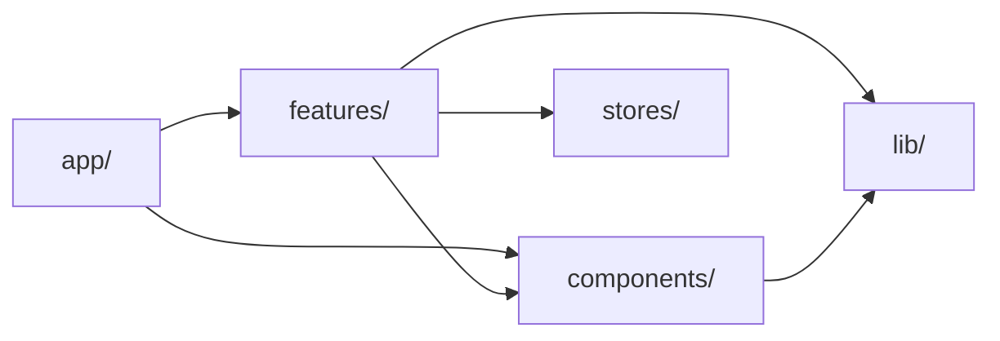

# 開発規約：フロントエンド（React / Next.js）

| 項目 | 内容 |
|---|---|
| バージョン | 1.0（初版） |
| 作成日 | 2026-10-05 |
| ステータス | 確定 |
| 対象 | `apps/web/` |
| 関連ドキュメント | `architecture.md`、`DESIGN.md`、`design/screens.md`、`conventions/branch-commit.md` |

このドキュメントは、`apps/web/`（Next.js）のコードの書き方を定めます。AI エージェントに画面を実装させるときは、本書と `DESIGN.md`、該当する機能仕様を必ず渡します。

---

## 1. 基本方針

- **Biome と TypeScript の型チェックが通らないコードはマージしない**。本書のルールのうち、ツールで検査できるものはツールに任せる。
- **サーバー側でできることはサーバー側でする**。コンポーネントは Server Component を基本とし、ブラウザでしか動かせない部分だけをクライアントコンポーネントにする。
- **Laravel API はブラウザから呼ばない**。Laravel を呼ぶのは Next.js のサーバー側（Server Components、Server Actions、Route Handlers）だけとする（`architecture.md` 4章、BFF 方式）。

---

## 2. ツールとコマンド

| 用途 | ツール | コマンド（例） |
|---|---|---|
| パッケージ管理 | Bun | `bun install`、`bun add <パッケージ>` |
| Lint・整形 | Biome | `bun run lint`、`bun run format` |
| 型チェック | TypeScript | `bun run typecheck`（`tsc --noEmit`） |
| Unit テスト | Vitest、React Testing Library | `bun run test` |
| E2E テスト | Playwright（Node.js 上で実行） | `bun run test:e2e` |

- コマンド名は `package.json` の `scripts` で上記のとおり定義する。
- エディタは保存時に Biome で整形する設定にする。
- Biome のルールを無効にする場合は、その行に理由を書く。ファイル全体やプロジェクト全体での無効化は、本書を更新してから行う。

  ```ts
  // biome-ignore lint/a11y/noAutofocus: 検索ダイアログを開いた直後に入力欄へ移動させるため
  ```

---

## 3. TypeScript

| ルール | 内容 |
|---|---|
| strict | `tsconfig.json` で `strict: true` と `noUncheckedIndexedAccess: true` を有効にする |
| `any` | 使わない。型が分からない値は `unknown` で受け、zod などで検証してから使う |
| 型の定義 | `type` を使う。`interface` は、外部ライブラリの型を拡張する場合に限る |
| `enum` | 使わない。文字列のユニオン型か `as const` を使う |
| 非 null アサーション（`!`） | 使わない。値がないケースを分岐で処理する |
| 型アサーション（`as`） | 最小限にする。使う場合は、なぜ安全かをコメントで書く |
| フォームの型 | zod のスキーマから `z.infer` で作る。スキーマと型を別々に書かない |

```ts
// 良い例：ユニオン型
type CastleCategory = "top100" | "zoku100" | "other";

// 悪い例：enum
enum CastleCategory { Top100, Zoku100, Other }
```

---

## 4. 命名

### 4.1 一覧

| 対象 | 形式 | 例 |
|---|---|---|
| ディレクトリ | kebab-case | `features/castle-map/`、`features/visit/` |
| コンポーネントのファイル | PascalCase | `CastleCard.tsx` |
| コンポーネント | PascalCase | `CastleCard` |
| Props の型 | コンポーネント名＋`Props` | `CastleCardProps` |
| カスタムフックのファイル・関数 | camelCase、`use` で始める | `useCastleFilter.ts`、`useCastleFilter` |
| そのほかの TypeScript ファイル | camelCase | `formatDate.ts`、`apiClient.ts` |
| 機能ごとの決まったファイル | 小文字（5.2 を参照） | `actions.ts`、`schemas.ts`、`queries.ts`、`types.ts` |
| 関数・変数 | camelCase | `fetchCastles`、`visitedCount` |
| 真偽値 | `is`、`has`、`can` で始める | `isVisited`、`hasError`、`canEdit` |
| 定数（モジュールのトップレベルで固定の値） | UPPER_SNAKE_CASE | `MAX_UPLOAD_SIZE` |
| 型 | PascalCase | `Castle`、`Visit` |
| zod スキーマ | camelCase＋`Schema` | `visitSchema` |
| zod から作る型 | PascalCase＋`Input` | `VisitInput` |
| Server Actions | 動詞で始まる camelCase＋`Action` | `registerVisitAction` |
| イベントハンドラ（内部の関数） | `handle`＋イベント | `handleSubmit`、`handlePinClick` |
| イベントハンドラ（Props） | `on`＋イベント | `onSubmit`、`onPinClick` |
| zustand のストア | `use`＋名前＋`Store` | `useMapStore`（ファイルは `mapStore.ts`） |
| Unit テスト | 対象のファイル名＋`.test` | `CastleCard.test.tsx`、`formatDate.test.ts` |
| E2E テスト | kebab-case＋`.spec.ts` | `e2e/castle-search.spec.ts` |
| URL のパス | kebab-case | `/castles`、`/mypage`（`design/screens.md` に従う） |

### 4.2 例外：`components/ui/`

`src/components/ui/` は、shadcn/ui と mapcn の CLI が生成するファイルを置く場所です。CLI での追加・更新と食い違わないよう、ここだけは**生成されたファイル名（kebab-case）のまま**にします。

```
src/components/ui/
├── button.tsx        # shadcn/ui が生成（kebab-case のまま）
├── dialog.tsx
└── map.tsx           # mapcn が生成
```

このディレクトリのファイルを編集した場合は、ファイルの先頭に変更内容をコメントで残します（CLI で更新したときに上書きされたことに気づけるようにするため）。

### 4.3 ドメインの用語

城、武将、ゆかりなどのドメインの用語は、バックエンドと同じ英語名を使います。対応表は `docs/glossary.md` で管理し、フロントエンドとバックエンドで別の単語を使わないようにします。

---

## 5. ディレクトリ構成

### 5.1 全体

`architecture.md` 10章の構成に従います。

```
apps/web/src/
├── app/                      # ルーティングのみ。処理はできるだけ features/ に置く
│   ├── (public)/
│   ├── (member)/
│   └── admin/
├── features/                 # 機能単位のコード
│   ├── castle-map/
│   ├── castle-list/
│   └── visit/
├── components/
│   ├── ui/                   # shadcn/ui、mapcn（4.2）
│   └── layout/               # ヘッダー、フッターなど、全画面で使う部品
├── lib/
│   ├── api/                  # Laravel API クライアント
│   ├── auth/                 # Better Auth の設定。server.ts（サーバー用）と client.ts（ブラウザ用）に分ける
│   └── utils/                # 機能に依存しない関数
└── stores/                   # zustand のストア（複数の機能で使うもの）
```

### 5.2 機能ディレクトリの中身

必要なものだけを作ります。

```
features/visit/
├── components/
│   ├── VisitForm.tsx
│   └── VisitForm.test.tsx
├── hooks/
│   └── useVisitDraft.ts
├── actions.ts               # Server Actions
├── queries.ts               # Server Components から呼ぶデータ取得関数
├── schemas.ts               # zod スキーマ（フォームと Server Actions で共通）
└── types.ts                 # この機能だけで使う型
```

### 5.3 import のルール

| ルール | 理由 |
|---|---|
| `src/` 配下は `@/` から始まるパスで import する（例：`@/features/visit/actions`） | ファイルを移動しても import が壊れにくい |
| `features/` 同士で直接 import しない。複数の機能で使うものは `components/` や `lib/` に移す | 機能間の依存が絡み合うのを防ぐ |
| `index.ts` でまとめて export する（バレルファイル）は作らない | 循環参照と、不要なコードがクライアントに含まれることを防ぐ |
| `lib/api/` と `lib/auth/server.ts` の先頭に `import "server-only";` を書く。ログイン画面などで使う `lib/auth/client.ts` には秘密情報を扱う処理を置かない | Laravel の URL、Better Auth の秘密鍵、トークンを扱うコードが、誤ってクライアントに含まれるのを防ぐ |

依存の向きは次のとおりです。



---

## 6. コンポーネント

### 6.1 書き方

- コンポーネントは **function 宣言**で書く。
- export は **named export** とする（6.2 の例外を除く）。名前を変えて import できないため、検索しやすく、名前のぶれも防げる。
- Props の型は、コンポーネントの直前に `type XxxProps` として定義し、引数で分割代入する。
- 1ファイルに export するコンポーネントは1つにする。そのファイルの中だけで使う小さな部品は、同じファイルに置いてよい（export しない）。

```tsx
type CastleCardProps = {
  castle: Castle;
  isVisited: boolean;
  onSelect: (castleId: string) => void;
};

export function CastleCard({ castle, isVisited, onSelect }: CastleCardProps) {
  // ...
}
```

### 6.2 default export の例外

Next.js が default export を要求するファイルだけは、default export にします。

- `page.tsx`、`layout.tsx`、`template.tsx`、`loading.tsx`、`error.tsx`、`not-found.tsx`、`default.tsx`
- `opengraph-image.tsx` などのメタデータ用ファイル
- `next.config.ts`、`playwright.config.ts` などの設定ファイル

この場合も、関数には名前を付けます（`export default function CastlesPage() {}`）。名前のない関数はエラーの調査がしにくくなるためです。

### 6.3 Server Components とクライアントコンポーネント

- 何も指定しない Server Component を基本とする。
- `"use client"` は、次のいずれかが必要なコンポーネントにだけ付ける。
  - `useState`、`useEffect` などのフック
  - クリックなどのイベントハンドラ
  - `window`、`localStorage` など、ブラウザにしかない機能
  - 地図（MapLibre）
- `"use client"` を付ける範囲はできるだけ末端（小さい部品）にする。ページ全体をクライアントコンポーネントにしない。
- 地図のコンポーネントは、クライアントコンポーネントの中で `next/dynamic` を使い、`ssr: false` で読み込む（`architecture.md` 5.1）。
- Server Component からクライアントコンポーネントに渡す Props は、シリアライズできる値（文字列、数値、配列、プレーンなオブジェクト）だけにする。関数や `Date` は渡さない（日付は ISO 8601 の文字列で渡す）。

---

## 7. データの取得と更新

### 7.1 使い分け

| 処理 | 実装場所 | 置き場所 |
|---|---|---|
| 一覧・詳細などの表示用データの取得 | Server Components から関数を呼ぶ | `features/*/queries.ts` |
| 会員・管理者の操作（登録、更新、削除） | Server Actions | `features/*/actions.ts` |
| ファイルのアップロード（写真、CSV） | Route Handlers | `app/api/**/route.ts` |

クライアントコンポーネントから `fetch` で Laravel や Route Handlers のデータを取りに行く実装は、原則として行いません。必要な場合は理由を機能仕様に書きます。

### 7.2 API クライアント

- Laravel を呼ぶ処理は、`lib/api/` のクライアントを経由する。各所で `fetch` を直接書かない。
- 接続先は環境変数 `API_BASE_URL` で切り替える（Apidog のモックと Laravel。`architecture.md` 9.4）。`NEXT_PUBLIC_` は付けない。
- 会員の操作では、セッションをもとに Better Auth でアクセストークン（JWT）を発行して `Authorization` ヘッダーに付ける処理を、クライアントの中にまとめる。発行した JWT はクライアントコンポーネントに渡さない（`architecture.md` 6.1）。

### 7.3 キャッシュ

- 公開データ（城、武将、公開プロフィール）は Next.js のデータキャッシュに載せ、タグを付ける。
- タグ名は `<リソースの複数形>` と `<リソース>:<ID>` の形にする（例：`castles`、`castle:123`）。
- 更新を行う Server Actions では、成功したあとに関係するタグを `revalidateTag` で無効化する（`architecture.md` 4.3）。
- 会員ごとのデータ（マイページ、通知）はキャッシュしない。

### 7.4 Server Actions

ファイルの先頭に `"use server";` を書き、次の順番で処理します。

1. 入力を zod のスキーマで検証する（`safeParse`）。クライアント側で検証済みでも、必ずもう一度検証する。
2. セッションを確認する。未ログインなら、API を呼ぶ前にエラーを返す。
3. API クライアントで Laravel を呼ぶ。会員 ID など本人を表す値は、クライアントから受け取らずセッションから取る。
4. API のエラーを、画面で表示できる形に変換する（`docs/design/errors.md` に従う）。
5. 成功したら、キャッシュを無効化する。

戻り値は、次の型にそろえます。想定どおりの失敗（入力エラー、権限なし、重複など）は例外を投げず、この型で返します。

```ts
// src/lib/action-result.ts
export type ActionResult<T = void> =
  | { ok: true; data: T }
  | {
      ok: false;
      error: {
        code: string; // docs/design/errors.md のエラーコード
        message: string; // 画面に表示する文言
        fieldErrors?: Record<string, string[]>;
      };
    };
```

権限のチェックは Laravel が行います。Next.js 側で画面の表示を出し分けることはあっても、それをセキュリティの対策とみなしません（`architecture.md` 4.3）。

---

## 8. フォーム

- react-hook-form と zod を使い、`@hookform/resolvers/zod` でつなぐ。
- スキーマは `features/*/schemas.ts` に置き、フォームと Server Actions で同じものを使う。
- エラーメッセージは日本語でスキーマに書く。文言は `docs/design/errors.md` に合わせる。
- Server Actions が返した `fieldErrors` は、`setError` で該当する入力欄に表示する。
- 入力欄には必ず `<label>` を付け、エラーメッセージは `aria-describedby` で入力欄と結びつける。エラーがある入力欄には `aria-invalid="true"` を付ける。
- 送信中はボタンを押せない状態にし、送信中であることを表示する（二重送信の防止）。

```ts
// features/visit/schemas.ts
export const visitSchema = z.object({
  castleId: z.string().min(1),
  visitedOn: z.string().date("訪問日を正しい形式で入力してください"),
  memo: z.string().max(500, "メモは500文字以内で入力してください").optional(),
});

export type VisitInput = z.infer<typeof visitSchema>;
```

---

## 9. 状態管理

状態は、次の優先順位で置き場所を決めます。

| 優先 | 状態の種類 | 置き場所 | 例 |
|---|---|---|---|
| 1 | サーバーのデータ | Server Components で取得し、Props で渡す | 城の一覧、会員の訪問記録 |
| 2 | URL で共有・復元したい状態 | URL のクエリ（`searchParams`） | 検索キーワード、絞り込み、ページ番号 |
| 3 | 1つのコンポーネントの中だけの状態 | `useState` | ダイアログの開閉 |
| 4 | 離れたコンポーネント間で共有する UI の状態 | zustand | 地図の表示位置、選択中のピン |

zustand のルール：

- サーバーのデータ（API のレスポンス）や個人情報は持たない（`architecture.md` 2.1）。
- ストアは関心ごとに分ける（`useMapStore`、`useFilterPanelStore` など）。1つの大きなストアにまとめない。
- コンポーネントでは、必要な値だけをセレクタで取り出す（不要な再描画を防ぐため）。

  ```ts
  const selectedCastleId = useMapStore((state) => state.selectedCastleId);
  ```

---

## 10. スタイリング

- Tailwind CSS のクラスで書く。`style` 属性は、実行時にしか決まらない値（地図上の座標など）に限る。
- 色、文字の大きさ、余白などは `DESIGN.md` で定めたトークンを使う。任意の値（`text-[13px]` など）は、トークンで表せない場合に限る。
- クラスを条件で切り替える場合は、`cn()`（`lib/utils/`）を使う。
- 画像は `next/image` で表示する。CloudFront のドメインを `next.config.ts` の `images.remotePatterns` に登録する。

---

## 11. アクセシビリティ

WCAG 2.2 レベル AA を目標とします（NFR-07）。詳しい基準は `DESIGN.md` に従い、コードでは次を守ります。

- 見た目ではなく役割に合った HTML 要素を使う。画面を移動するものは `<a>`（`next/link`）、操作を実行するものは `<button>` にする。`<div onClick>` は使わない。
- すべての画像に `alt` を付ける。飾りの画像は `alt=""` にする。
- アイコンだけのボタンには、`aria-label` で名前を付ける。
- キーボードだけですべての操作ができ、フォーカスの位置が見えるようにする。
- 情報を色だけで区別しない（地図のピンは形やアイコンでも区別する。NFR-07）。
- タップできる部品は 44px × 44px 以上の範囲で反応させる（`DESIGN.md` の `touch-target`）。
- フォームの送信結果やトーストなど、動的に表示されるメッセージは `aria-live` で読み上げられるようにする。
- 地図で見られる情報は、城一覧と検索でも同じようにたどれるようにする（NFR-07）。

---

## 12. セキュリティ

- `dangerouslySetInnerHTML` は使わない。どうしても必要な場合は、サニタイズしたうえで、理由をコメントに書く。
- `NEXT_PUBLIC_` を付けた環境変数はブラウザに公開される。公開してよい値（サイトの URL など）以外には付けない。Better Auth の秘密鍵や Google の OAuth クライアントシークレットには絶対に付けない。
- アクセストークン、Cookie の値、会員のメールアドレスなどの個人情報を、ログや Sentry に送らない。
- 外部サイトへのリンクを新しいタブで開く場合は、`rel="noopener noreferrer"` を付ける。
- 秘密情報をコードに直接書かない。`.env.example` には変数名だけを書き、値は空にする。

---

## 13. エラー処理

- 画面のまとまり（ルートセグメント）ごとに `error.tsx` と `not-found.tsx` を置き、予期しないエラーでも画面全体が壊れないようにする。
- 予期しないエラーは Sentry に送る（`architecture.md` 8章）。
- 利用者に見せる文言は `docs/design/errors.md` に従い、内部のエラーメッセージやスタックトレースをそのまま表示しない。

---

## 14. テスト

ツールの使い分けは `architecture.md` 2.4 に従います。

### 14.1 共通

- テスト名は**日本語**で書く。何を確認しているかが、仕様（受け入れ基準）と同じ言葉で読めるようにするため。
- 1つのテストでは1つのことを確認する。準備・実行・確認（Arrange / Act / Assert）の順に書く。

### 14.2 Vitest（Unit テスト）

- テストファイルは対象のファイルの隣に置く（`CastleCard.tsx` と `CastleCard.test.tsx`）。
- `describe` に対象（コンポーネント名や関数名）、`it` に確認する振る舞いを書く。
- 要素は、利用者から見える情報で探す。優先順位は `getByRole` → `getByLabelText` → `getByText` とし、`getByTestId` は最後の手段にする。
- 外部の処理（Server Actions、API クライアント）は `vi.mock` で置き換える。
- スナップショットテストは使わない（変更のたびに更新するだけになりやすいため）。

```tsx
describe("VisitForm", () => {
  it("訪問日を入力せずに送信すると、エラーメッセージを表示する", async () => {
    // ...
  });
});
```

### 14.3 Playwright（E2E テスト）

- `apps/web/e2e/` に置く。ファイルは、主要なユーザーの流れごとに分ける（`castle-search.spec.ts` など）。
- テスト名の先頭に、対応する受け入れ基準の ID を付ける。`docs/testing.md` の対応表と結びつけるため。

  ```ts
  test("AC-01-3: 地図を縮小すると、近くの城がまとめて表示される", async ({ page }) => {
    // ...
  });
  ```

- 要素の探し方は 14.2 と同じ優先順位にする。
- テストどうしでデータを共有しない。必要なデータは、各テストの中で準備する。

---

## 15. コメント

- コメントは日本語で書く。
- 何をしているかではなく、**なぜそうしているか**を書く。コードを読めば分かることは書かない。
- 後で対応する作業は、Linear の Issue を作ったうえで `// TODO(TAK-123): 内容` の形で書く。Issue 番号のない TODO は残さない。

---

## 16. AI エージェントに実装させるときのチェック

AI が書いたコードは、マージ前に次を確認します。

- [ ] 不要な `"use client"` が付いていない。
- [ ] ブラウザから Laravel を直接呼んでいない。`NEXT_PUBLIC_API_...` のような変数を作っていない。
- [ ] `any`、`enum`、非 null アサーションを使っていない。
- [ ] 本書にない新しいパッケージを追加していない。
- [ ] 自分でコードの動きを説明できる。

---

## 改訂履歴

| バージョン | 日付 | 内容 |
|---|---|---|
| 1.0 | 2026-10-05 | 初版作成 |