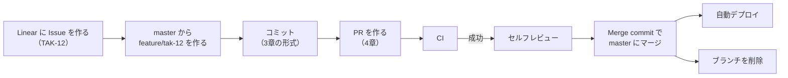

# 開発規約：ブランチ戦略・コミットメッセージ

| 項目 | 内容 |
|---|---|
| バージョン | 1.0（初版） |
| 作成日 | 2026-10-05 |
| ステータス | 確定 |
| 関連ドキュメント | `constitution.md`、`architecture.md`、`conventions/React-Nextjs.md`、`conventions/PHP-Laravel.md` |

このドキュメントは、ブランチの切り方、コミットメッセージの書き方、プルリクエスト（PR）の出し方を定めます。人が書くコミットも、AI エージェント（Claude Code など）が書くコミットも、同じ規約に従います。

---

## 1. 前提

| 項目 | 決定内容 | 理由 |
|---|---|---|
| ブランチ戦略 | GitHub Flow（`master`＋作業ブランチ） | 一人開発で、master へのマージで本番に自動デプロイする（`architecture.md` 9.2）。リリース用のブランチを持つ必要がない |
| タスク管理 | Linear（チームキー `TAK`） | 作業はすべて Linear の Issue から始める。|
| マージ方法 | Merge commit | PR 内の作業の経過を履歴に残し、学習の記録とするため |
| コミットメッセージ | Conventional Commits（type は英語、説明は日本語） | 変更の種類を機械的に判別でき、説明は自分が最も正確に書ける言語で書くため |

Merge commit を採用するため、PR 内の**すべてのコミット**が master の履歴にそのまま残ります。PR のタイトルだけでなく、個々のコミットメッセージも本規約に従ってください。

---

## 2. ブランチ

### 2.1 ブランチの種類

| ブランチ | 寿命 | 役割 |
|---|---|---|
| `master` | 永続 | 常に本番にデプロイできる状態を保つ。マージすると自動でデプロイされる |
| 作業ブランチ | 短期（数日以内が目安） | Linear の Issue 1件に対応する作業を行う。マージ後に削除する |

`develop` や `release/*` などの長期ブランチは作りません。

### 2.2 作業ブランチの命名

```
<種類>/tak-<Issue番号>
```

| 例 | 意味 |
|---|---|
| `feature/tak-12` | TAK-12 の新機能を実装する |
| `fix/tak-34` | TAK-34 の不具合を修正する |
| `docs/tak-56` | TAK-56 の仕様・設計ドキュメントを更新する |

| 種類 | 用途 | 対応するコミットの type（3章） |
|---|---|---|
| `feature` | 新機能の追加 | `feat` |
| `fix` | 不具合の修正 | `fix` |
| `docs` | ドキュメントのみの変更（仕様、設計、`openapi.yaml` を含む） | `docs` |
| `refactor` | 振る舞いを変えないコードの整理 | `refactor` |
| `test` | テストの追加・修正のみ | `test` |
| `chore` | 依存パッケージの更新、設定ファイルの変更など | `chore`、`build` |
| `ci` | GitHub Actions のワークフローの変更 | `ci` |

ルール：

- すべて小文字で書く。Issue 番号は Linear 上の表記（`TAK-12`）を小文字にしたもの（`tak-12`）とする。
- 1つのブランチでは、1つの Issue だけを扱う。作業中に別の問題を見つけたら、Linear に新しい Issue を作り、別ブランチで対応する。
- 種類は、そのブランチの主な目的で選ぶ。新機能の実装に伴う仕様書やテストの追加は `feature` に含めてよい。
- Linear の「Copy git branch name」で得られる名前（初期設定では担当者名や Issue のタイトルが付く）は使わず、上記の形式で手入力する。

### 2.3 Linear との連携

- Linear の GitHub 連携を有効にする。ブランチ名に `tak-<番号>` が含まれていれば、ブランチと PR が Issue に自動で紐づき、PR の作成・マージに合わせて Issue の状態が変わる。
- Linear に Issue がない作業は始めない。誤字の修正のような小さな変更でも Issue を作る（作業時間の記録と見積もりの精度向上のため。）。
- 見積もりは Linear の Estimate に入力し、完了後に計画との差を振り返る。

### 2.4 作業の流れ



1. Linear で Issue を作り、ステータスを「In Progress」にする。
2. 最新の `master` から作業ブランチを作る。

   ```bash
   git switch master
   git pull
   git switch -c feature/tak-12
   ```

3. 作業してコミットする。仕様を変える場合は、先にドキュメントを更新してから実装を変える。
4. PR を作り、CI がすべて成功することを確認する。
5. セルフレビュー（4.3）を終えたら、Merge commit でマージする。
6. マージ後、作業ブランチは自動で削除される。手元のブランチも削除する。

### 2.5 master への追従

作業中に `master` が進んだ場合は、次のように取り込みます。

| 状況 | 方法 |
|---|---|
| まだ push していない | `git rebase origin/master` で履歴を整理してよい |
| push 済み | `git rebase origin/master` のあと `git push --force-with-lease` で上書きしてよい（作業ブランチは自分しか使わないため）。`--force`（`-with-lease` なし）は使わない |
| PR のコンフリクトを GitHub 上で解消した | そのままでよい（master からのマージコミットが作業ブランチに入る） |

`master` への force push は、いかなる場合も行いません。

### 2.6 Apidog からの同期

Apidog で `docs/api/openapi.yaml` を編集した場合は、`master` ではなく作業ブランチ（`docs/tak-<番号>` または実装中の `feature/tak-<番号>`）に push し、PR と CI を通してからマージします（`architecture.md` 9.4）。Apidog が自動で作るコミットメッセージは本規約に合わないことがあるため、可能であれば Apidog 側でメッセージを指定し、できない場合は PR の説明にその旨を書きます。

### 2.7 緊急の修正

本番で不具合が起きた場合も、通常と同じ流れ（`fix/tak-<番号>` を `master` から作り、PR と CI を通す）で修正します。CI を省略して `master` に直接入れることはしません。直前のデプロイに戻すだけで済む場合は、先にロールバック（`architecture.md` 9.2）を行い、落ち着いて修正します。

---

## 3. コミットメッセージ

### 3.1 形式

[Conventional Commits 1.0.0](https://www.conventionalcommits.org/ja/v1.0.0/) に従います。type と scope は英語、説明・本文は日本語で書きます。

```
<type>(<scope>): <説明>

<本文（任意）>

<フッター（任意）>
```

例：

```
feat(web): 城一覧に名称での絞り込みを追加

読み仮名と別名にも部分一致するようにした。
検索条件は URL のクエリに持たせ、共有やブラウザバックで復元できるようにしている。

Refs: TAK-12
```

```
fix(api): 訪問日が未来の日付でも登録できる不具合を修正

Refs: TAK-34
```

### 3.2 type

| type | 用途 |
|---|---|
| `feat` | 新機能の追加 |
| `fix` | 不具合の修正 |
| `docs` | ドキュメントのみの変更 |
| `style` | コードの意味を変えない整形（Biome・Pint による整形など） |
| `refactor` | 振る舞いを変えないコードの整理 |
| `perf` | 性能の改善 |
| `test` | テストの追加・修正のみ |
| `build` | ビルド、Docker、依存パッケージに関する変更 |
| `ci` | GitHub Actions のワークフローの変更 |
| `chore` | 上記のどれにも当てはまらない雑務（設定ファイルの変更など） |
| `revert` | 以前のコミットの取り消し |

### 3.3 scope

モノレポのどこを変更したかを示します。省略してもよいですが、`apps/` や `infra/` を変更した場合は付けます。

| scope | 対象 |
|---|---|
| `web` | `apps/web/`（Next.js） |
| `api` | `apps/api/`（Laravel） |
| `infra` | `infra/`（Docker、Terraform、スクリプト） |
| `docs` | `docs/`（type が `docs` の場合は省略してよい） |
| `deps` | 依存パッケージの更新（`build(deps): ...` のように使う） |

1つのコミットで `web` と `api` の両方を変更した場合は、scope を省略するか、主な変更先を書きます。ただし、できる限りコミットを分けます（3.6）。

### 3.4 説明（1行目）

- 日本語で、何をしたかを簡潔に書く。全体で50文字程度までを目安とする。
- 文末は「〜を追加」「〜を修正」のような体言止めにそろえ、句点（。）を付けない。
- 「修正」「対応」だけのように、内容が分からない説明は書かない。
  - 悪い例：`fix(web): 不具合修正`
  - 良い例：`fix(web): スマホで地図のピンをタップできない不具合を修正`

### 3.5 本文とフッター

- 本文には、**なぜその変更をしたか**を書く。何をしたかはコードの差分で分かるため、理由や背景、検討したほかの方法を優先する。
- 本文は1行目との間に空行を1行入れる。1行は72文字程度を目安に折り返す。
- フッターには、関連する Linear の Issue を `Refs: TAK-<番号>` の形で書く。ブランチ名で Issue と紐づくため必須ではないが、履歴から Issue をたどりやすくするために付けることを推奨する。
- 互換性のない変更（API のレスポンス形式の変更など）は、type の後ろに `!` を付け、フッターに `BREAKING CHANGE:` で内容を書く。

  ```
  feat(api)!: 城一覧 API のレスポンスをページ分割形式に変更

  BREAKING CHANGE: レスポンスのトップレベルが配列から { data, meta } の形になった
  Refs: TAK-40
  ```

### 3.6 コミットの粒度

- 1つのコミットには、1つのまとまった変更だけを含める。
- 整形（`style`）と処理の変更は、同じコミットに混ぜない。差分のレビューがしにくくなるため。
- 各コミットの時点で、少なくともビルドと型チェックが通る状態を保つ。
- 作業途中の「WIP」コミットは、push 前に `git rebase -i` でまとめる。Merge commit では PR 内のコミットがそのまま master に残るため。

### 3.7 AI エージェントが作るコミット

- AI エージェントにも本規約（特に3章）を渡し、同じ形式でコミットさせる。
- Claude Code などが付ける `Co-Authored-By:` の行は、AI を使ったことの記録として残す。
- AI が作ったコミットも、自分で内容を説明できる状態になってからマージする。

---

## 4. プルリクエスト

### 4.1 タイトル

コミットメッセージの1行目と同じ形式で書きます。マージコミットのメッセージに PR のタイトルが使われるためです（6章の設定）。

```
feat(web): 城一覧に名称での絞り込みを追加
```

### 4.2 説明

`.github/pull_request_template.md` に次のテンプレートを置きます。

```markdown
## 概要
<!-- 何を、なぜ変更したか -->

## 関連
- Linear: TAK-
- 機能仕様: docs/specs/
- 受け入れ基準: AC-

## 変更内容
-

## 確認したこと
- [ ] 受け入れ基準を満たすことを確認した
- [ ] テストを追加・更新した
- [ ] 仕様・設計ドキュメントを先に更新した（仕様を変える場合）
- [ ] 画面の変更がある場合、スマホ幅で表示を確認した

## スクリーンショット
<!-- 画面の変更がある場合 -->

## AI の利用
- [ ] AI が書いたコードを含む場合、すべて自分で説明できる
```

### 4.3 セルフレビュー

一人開発のため、承認（Approve）は必須にしません（自分の PR は自分で承認できないため）。代わりに、マージ前に次を確認します。

- GitHub の「Files changed」で差分を最初から最後まで読んだ。
- 秘密情報（API キー、パスワード、`.env` の値）が含まれていない。
- デバッグ用のコード（`console.log`、`dd()`、`dump()` など）が残っていない。
- 本 PR のテンプレートのチェック項目をすべて満たした。

### 4.4 大きさ

- 差分（自動生成ファイルを除く）は、400行程度までを目安にする。超える場合は、Issue を分けられないか検討する。
- 作業途中で CI を確認したい場合は、Draft PR として作る。

---

## 5. タグとリリース

GitHub Flow のため、リリース用のブランチは作りません。デプロイの単位は `master` へのマージであり、Docker イメージにはコミットのハッシュをタグとして付けます（`architecture.md` 9.2 のロールバックで使う）。

区切りのよい時点（第一フェーズの公開など）で、`master` に `v1.0.0` のようなバージョンタグを付け、`CHANGELOG.md` を更新します。バージョンの付け方は [Semantic Versioning](https://semver.org/lang/ja/) に従います。

---

## 6. GitHub リポジトリの設定

本規約を守るために、リポジトリに次の設定を行います。

| 設定箇所 | 設定 | 理由 |
|---|---|---|
| Settings → General → Pull Requests | 「Allow merge commits」のみ有効にし、「Allow squash merging」「Allow rebase merging」は無効にする | マージ方法を Merge commit に統一する |
| 同上 | マージコミットの既定のメッセージを「Pull request title and description」にする | マージコミットの1行目を Conventional Commits の形式にする |
| 同上 | 「Automatically delete head branches」を有効にする | マージ済みのブランチを残さない |
| ブランチ保護（`master`） | PR を必須にし、直接の push を禁止する | 仕様の変更も含め、すべての変更に CI を通す（`architecture.md` 9.4） |
| 同上 | 必須のステータスチェックに CI のジョブを指定する | CI が通らないコードはマージしない |
| 同上 | force push とブランチの削除を禁止する | `master` の履歴を守る |
| 同上 | 必要な承認数は 0 とする | 一人開発のため（4.3） |

コミットメッセージの形式を自動でチェックするツール（commitlint など）は、第一フェーズでは導入しません。導入する場合は、憲章 7.1 に従い理由を `architecture.md` に記録してから採用します。

---

## 改訂履歴

| バージョン | 日付 | 内容 |
|---|---|---|
| 1.0 | 2026-10-05 | 初版作成 |