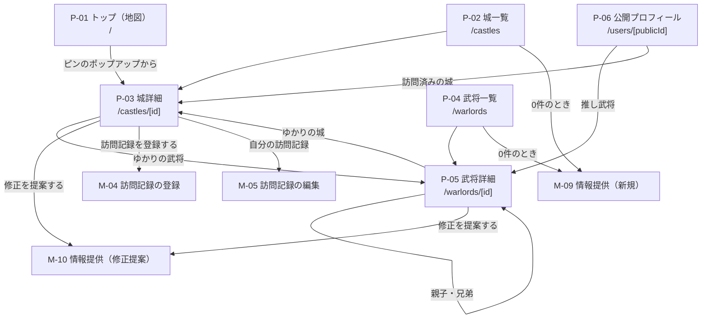
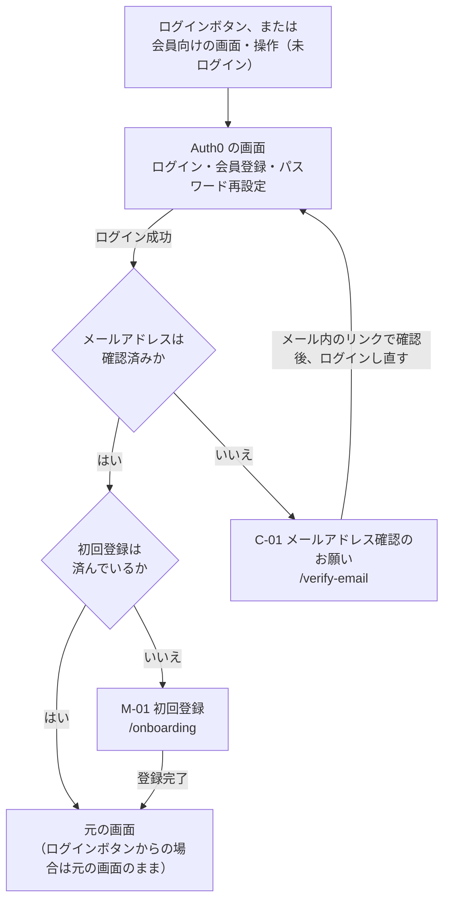
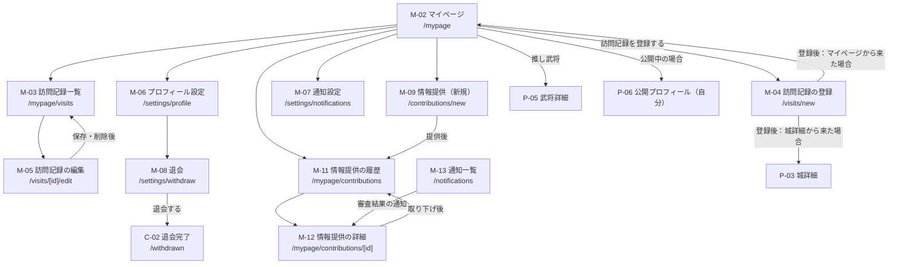
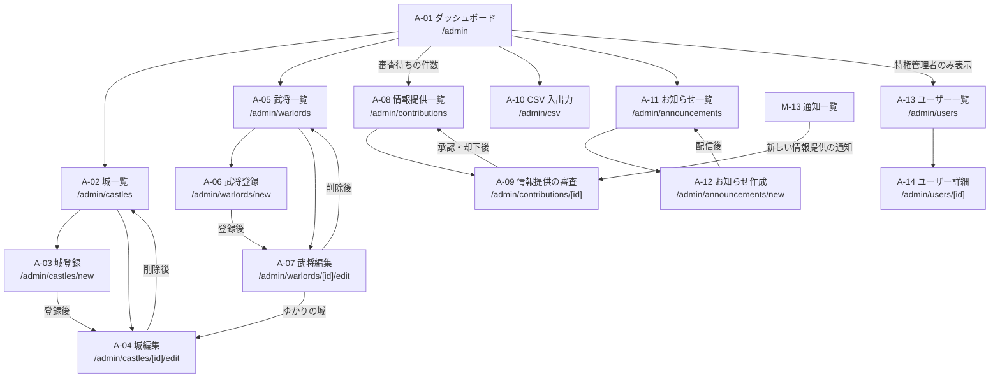

# 画面一覧・画面遷移図：城将（仮）第一フェーズ

| 項目 | 内容 |
|---|---|
| バージョン | 1.0（初版） |
| 作成日 | 2026-10-05 |
| ステータス | レビュー待ち |
| 関連ドキュメント | `constitution.md`、`requirements.md`、`architecture.md` |

このドキュメントは、第一フェーズの画面の一覧、URL、アクセスに必要な権限、画面同士の遷移を定めます。各画面の詳しい振る舞い（表示項目、バリデーション、エラー時の挙動）は `docs/specs/` の機能仕様書で、レイアウトは `docs/design/wireframes.md` で定めます。

---

## 1. 方針

### 1.1 URL の設計

| 方針 | 内容 |
|---|---|
| 言語 | URL は英語の小文字とし、単語の区切りはハイフンにする |
| 城・武将の詳細 | 数値の ID を使う（例：`/castles/12`） |
| 公開プロフィール | 公開用の ID を使う（例：`/users/k7Qm2xPa`）。ユーザー名を変えても URL が変わらないようにし、連番ではなく推測できないランダムな文字列とする。形式は `data-model.md` で定める |
| 検索条件 | クエリパラメータで URL に反映し、共有・再訪で同じ結果を表示する（AC-03-6、AC-05-5） |
| 管理画面 | `/admin` 以下にまとめる（`architecture.md` 10章） |
| 認証用のルート | ログイン、ログアウト、コールバックは `@auth0/nextjs-auth0` が提供するルート（例：`/auth/login`）を使う。画面ではないため一覧には含めない |

### 1.2 画面 ID

| 接頭辞 | 区分 | Next.js のルートグループ |
|---|---|---|
| `P-xx` | 一般向け（未ログインでも閲覧できる） | `(public)` |
| `M-xx` | 会員向け（ログインが必要） | `(member)` |
| `A-xx` | 管理画面（管理者以上） | `admin` |
| `C-xx` | 共通（認証の途中、エラーなど） | `(public)` |

### 1.3 アクセス権限の表記

| 表記 | 意味 |
|---|---|
| 不要 | 誰でもアクセスできる |
| ログイン | ログインしていれば、会員登録の途中でもアクセスできる |
| 会員 | メールアドレス確認と初回登録（M-01）を終えた会員。管理者・特権管理者も含む |
| 管理者 | 管理者または特権管理者 |
| 特権管理者 | 特権管理者のみ |

画面の表示制御は利用者の使い勝手のためのものであり、権限のチェックは必ず Laravel API 側で行う（`requirements.md` 3.2）。

### 1.4 アクセスできない場合の扱い

| 状況 | 扱い |
|---|---|
| 未ログインで「会員」「ログイン」の画面を開いた | ログイン画面（Auth0）へ移動し、ログイン後に元の画面へ戻る（AC-08-4） |
| メールアドレスが未確認 | C-01 メールアドレス確認のお願い へ移動する（AC-07-2） |
| 初回登録（ユーザー名の入力）が済んでいない | M-01 初回登録 へ移動し、完了後に元の画面へ戻る（AC-07-4） |
| 会員が管理画面（`/admin` 以下）を開いた | C-03 ページが見つかりません を表示する（管理画面の存在を知らせない） |
| 管理者が特権管理者専用の画面を開いた | C-04 アクセス権限がありません を表示する |
| 存在しない、または削除された城・武将 | C-03 ページが見つかりません を表示する |
| 非公開・利用停止中・退会済み・存在しない会員の公開プロフィール | すべて同じ C-03 ページが見つかりません を表示し、どの状態かが分からないようにする（AC-13-5、AC-24-2） |
| 他人の訪問記録の編集画面を開いた | C-03 ページが見つかりません を表示する（記録の存在を知らせない） |

---

## 2. 画面一覧

### 2.1 一般向け

| 画面 ID | 画面名 | URL | 権限 | 主な内容 | 関連要件 |
|---|---|---|---|---|---|
| P-01 | トップ（地図） | `/` | 不要 | 日本地図と全城のピン、城の検索ボックス、絞り込み、ピン選択時のポップアップ。ログイン中は訪問済みのピンを区別して表示 | US-01、US-02、AC-12-1 |
| P-02 | 城一覧 | `/castles` | 不要 | キーワード検索、絞り込み、並べ替え、ページ分割、0件時のメッセージと情報提供への案内 | US-03 |
| P-03 | 城詳細 | `/castles/[id]` | 不要 | 城の情報、ゆかりの武将、位置の小地図、画像と出典、修正提案ボタン。ログイン中は訪問記録の登録ボタンと自分の訪問記録 | US-04、AC-11-1 |
| P-04 | 武将一覧 | `/warlords` | 不要 | キーワード検索、絞り込み、並べ替え、ページ分割、0件時のメッセージと情報提供への案内 | US-05 |
| P-05 | 武将詳細 | `/warlords/[id]` | 不要 | 武将の情報、親子・兄弟、ゆかりの城と位置の小地図、画像と出典、修正提案ボタン | US-06 |
| P-06 | 公開プロフィール | `/users/[publicId]` | 不要 | ユーザー名、推し武将、訪問済みの城の地図、訪問済みの城数、訪問記録。出身・居住都道府県は会員の設定に従って表示 | US-13 |
| P-07 | 利用規約 | `/terms` | 不要 | 利用規約 | NFR-06 |
| P-08 | プライバシーポリシー | `/privacy` | 不要 | プライバシーポリシー | NFR-06 |

### 2.2 会員向け

| 画面 ID | 画面名 | URL | 権限 | 主な内容 | 関連要件 |
|---|---|---|---|---|---|
| M-01 | 初回登録 | `/onboarding` | ログイン | ユーザー名の入力（重複チェック付き）、利用規約とプライバシーポリシーへの同意 | AC-07-3、AC-07-4、AC-07-5 |
| M-02 | マイページ | `/mypage` | 会員 | 推し武将、訪問済みの城数と割合（100名城・続100名城別）、御城印・スタンプの入手数、最近の訪問記録、各画面へのリンク | AC-09-3、AC-12-2、AC-12-4 |
| M-03 | 訪問記録一覧 | `/mypage/visits` | 会員 | 自分の訪問記録を訪問日順で一覧表示（ページ分割）、編集画面へのリンク | AC-12-3、AC-11-5 |
| M-04 | 訪問記録の登録 | `/visits/new` | 会員 | 城の選択（城詳細から来た場合は選択済み）、訪問日、メモ、評価、写真、御城印・スタンプの入手有無 | US-11 |
| M-05 | 訪問記録の編集 | `/visits/[id]/edit` | 会員（本人のみ） | M-04 と同じ項目の編集、削除 | AC-11-5 |
| M-06 | プロフィール設定 | `/settings/profile` | 会員 | ユーザー名、出身・居住都道府県とそれぞれの公開有無、推し武将の登録・変更・解除、プロフィールの公開設定、公開プロフィールの URL | US-09、AC-13-1、AC-13-3 |
| M-07 | 通知設定 | `/settings/notifications` | 会員 | 審査結果のメール通知を受け取るかどうか | AC-17-3 |
| M-08 | 退会 | `/settings/withdraw` | 会員 | 退会すると削除されるもの・残るものの説明、退会の確認 | AC-10-1〜AC-10-4 |
| M-09 | 情報提供（新規） | `/contributions/new` | 会員 | 対象（城・武将）の選択、新規データの入力、出典（必須）、提供者名の表示有無 | US-14 |
| M-10 | 情報提供（修正提案） | `/castles/[id]/suggest` `/warlords/[id]/suggest` | 会員 | 現在の値の表示、修正したい項目と修正後の値、出典（必須）、提供者名の表示有無 | US-15 |
| M-11 | 情報提供の履歴 | `/mypage/contributions` | 会員 | 自分の情報提供の一覧と状態（審査待ち、承認、却下） | AC-16-1 |
| M-12 | 情報提供の詳細 | `/mypage/contributions/[id]` | 会員（本人のみ） | 提供した内容、状態、却下理由、取り下げ（審査待ちの場合のみ） | AC-16-2、AC-16-3 |
| M-13 | 通知一覧 | `/notifications` | 会員 | 通知の一覧、既読にする、通知に関係する画面へのリンク | AC-17-2 |

### 2.3 管理画面

| 画面 ID | 画面名 | URL | 権限 | 主な内容 | 関連要件 |
|---|---|---|---|---|---|
| A-01 | ダッシュボード | `/admin` | 管理者 | 審査待ちの件数、最近の変更、各管理画面へのリンク | US-20 |
| A-02 | 城一覧（管理） | `/admin/castles` | 管理者 | 検索・絞り込み付きの一覧、登録・編集画面へのリンク | AC-18-1 |
| A-03 | 城登録 | `/admin/castles/new` | 管理者 | 城の情報の入力（緯度経度の範囲チェック付き） | AC-18-1、AC-18-2 |
| A-04 | 城編集 | `/admin/castles/[id]/edit` | 管理者 | 城の情報の編集、画像の登録・差し替え・削除、削除（論理削除）、変更履歴 | AC-18-1〜AC-18-4、US-22 |
| A-05 | 武将一覧（管理） | `/admin/warlords` | 管理者 | 検索・絞り込み付きの一覧、登録・編集画面へのリンク | AC-19-1 |
| A-06 | 武将登録 | `/admin/warlords/new` | 管理者 | 武将の情報の入力 | AC-19-1 |
| A-07 | 武将編集 | `/admin/warlords/[id]/edit` | 管理者 | 武将の情報の編集、ゆかりの城、親子・兄弟、画像、削除（論理削除）、変更履歴 | AC-19-1〜AC-19-5、US-22 |
| A-08 | 情報提供一覧 | `/admin/contributions` | 管理者 | 情報提供の一覧（初期表示は審査待ち）、状態・種類・対象での絞り込み | AC-20-1 |
| A-09 | 情報提供の審査 | `/admin/contributions/[id]` | 管理者 | 提供内容、修正提案の場合は現在の値との比較、承認前の修正、承認、却下（理由必須） | AC-20-2〜AC-20-5 |
| A-10 | CSV 入出力 | `/admin/csv` | 管理者 | 対象（城、武将、ゆかり）の選択、アップロードと検証結果（行番号とエラー内容）、ダウンロード、CSV 形式の説明へのリンク | US-21 |
| A-11 | お知らせ一覧 | `/admin/announcements` | 管理者 | 配信済みのお知らせの一覧 | US-23 |
| A-12 | お知らせ作成 | `/admin/announcements/new` | 管理者 | お知らせの作成と配信 | US-23 |
| A-13 | ユーザー一覧 | `/admin/users` | 特権管理者 | 会員の検索・一覧、ロール・状態での絞り込み | AC-24-1 |
| A-14 | ユーザー詳細 | `/admin/users/[id]` | 特権管理者 | 会員の情報、利用停止・解除、ロールの変更（管理者の付与・解除）、訪問記録の一覧と不適切な記録の非表示 | AC-24-2、AC-24-3、US-25 |

### 2.4 共通

| 画面 ID | 画面名 | URL | 権限 | 主な内容 | 関連要件 |
|---|---|---|---|---|---|
| C-01 | メールアドレス確認のお願い | `/verify-email` | ログイン | 確認メールを送ったことの案内、確認後にログインし直す手順 | AC-07-2 |
| C-02 | 退会完了 | `/withdrawn` | 不要 | 退会が完了したことの案内、トップへのリンク | US-10 |
| C-03 | ページが見つかりません | （該当なし） | 不要 | 404。トップ・城一覧・武将一覧へのリンク | AC-13-5 |
| C-04 | アクセス権限がありません | （該当なし） | 不要 | 403。管理画面のダッシュボードへのリンク | `requirements.md` 3.2 |
| C-05 | エラーが発生しました | （該当なし） | 不要 | 500。時間をおいて再度試すよう案内 | NFR-11 |

### 2.5 外部の画面（Auth0）

以下は Auth0 の Universal Login が提供する画面であり、本サービスでは実装しない。ロゴや色など、Auth0 の設定で変えられる範囲で本サービスの見た目に合わせる。

| 画面 | 用途 | 関連要件 |
|---|---|---|
| ログイン | メールアドレス＋パスワード、Google でのログイン | AC-08-1 |
| 会員登録 | メールアドレス＋パスワード、Google での登録 | AC-07-1 |
| パスワード再設定 | パスワードを忘れた場合の再設定 | AC-08-2 |

利用停止中の会員は Auth0 でブロックされるため（`architecture.md` 6.3）、ログインできない旨は Auth0 の画面に表示される。

---

## 3. 検索条件のクエリパラメータ

各値の具体的なコード（都道府県コード、城郭構造のコードなど）は `data-model.md` のマスタデータに従う。

### 3.1 P-02 城一覧

| パラメータ | 意味 | 値の例 |
|---|---|---|
| `q` | キーワード（城名、別名） | `松本` |
| `pref` | 都道府県 | `20` |
| `province` | 旧国名 | `shinano` |
| `structure` | 城郭構造 | `hirajiro` |
| `category` | 100名城の区分 | `top100`、`zoku100` |
| `sort` | 並べ替え | `number`（100名城番号順、初期値）、`name`（名称順） |
| `page` | ページ番号 | `2` |

### 3.2 P-04 武将一覧

| パラメータ | 意味 | 値の例 |
|---|---|---|
| `q` | キーワード（氏名、別名・通称） | `信長` |
| `province` | 出身（旧国名） | `owari` |
| `pref` | 出身（現在の都道府県） | `23` |
| `faction` | 所属勢力 | `oda` |
| `sort` | 並べ替え | `name`（名前順、初期値）、`birth`（生年順） |
| `page` | ページ番号 | `2` |

### 3.3 P-01 トップ（地図）の絞り込み（US-02、Should）

`pref`、`structure`、`category` は 3.1 と同じ値を使う。ログイン中は `visited`（`yes`：訪問済みのみ、`no`：未訪問のみ）も使える。地図の絞り込み条件を URL に反映するかは、US-02 の機能仕様で決める。

### 3.4 M-04 訪問記録の登録

| パラメータ | 意味 |
|---|---|
| `castleId` | 城詳細から来た場合に、城を選択済みにする |

---

## 4. 画面遷移図

画面上部のヘッダー（地図、城、武将、通知、マイページ／ログイン）とフッター（利用規約、プライバシーポリシー）からは、ほぼすべての画面に移動できる。図が複雑になるため、これらの共通ナビゲーションによる遷移は省略する。

### 4.1 一般向け

M-04、M-05、M-09、M-10 は会員向けの画面のため、未ログインの場合は 4.2 のログインの流れを経てから表示する。

### 4.2 ログイン・会員登録

- Google アカウントで登録した場合、メールアドレスは確認済みとして扱われるため C-01 は表示されない。
- ログアウトすると、トップ（P-01）へ移動する。

### 4.3 会員向け

- 情報提供（修正提案）M-10 は、提供後に M-11 情報提供の履歴 へ移動する。
- M-05 から削除した場合も、城詳細から来た場合は城詳細へ戻す。戻り先の決め方は訪問記録の機能仕様で定める。

### 4.4 管理画面

- 管理画面のヘッダーに、一般向けの画面（P-01）へ戻るリンクを置く。一般向けのヘッダーには、管理者以上の場合のみ管理画面へのリンクを表示する。
- 管理画面の一覧の検索条件も、一般向けと同じくクエリパラメータで URL に反映する。

---

## 5. ダイアログ（URL を持たない画面要素）

以下は独立した画面にせず、元の画面の上にダイアログとして表示する。いずれもキーボードで操作でき、閉じたときに元の位置へフォーカスを戻す（NFR-07）。

| ダイアログ | 表示する画面 | 関連要件 |
|---|---|---|
| ピンのポップアップ（城名、所在地、城郭構造の概要、詳細へのリンク） | P-01 | AC-01-5 |
| 訪問記録の削除確認 | M-05 | AC-11-5 |
| 推し武将の選択（武将を検索して選ぶ） | M-06 | AC-09-2 |
| 情報提供の取り下げ確認 | M-12 | AC-16-3 |
| 城・武将の削除確認 | A-04、A-07 | AC-18-3、AC-19-4 |
| 却下理由の入力 | A-09 | AC-20-4 |
| CSV の取り込み確認（登録・更新される件数の表示） | A-10 | AC-21-2 |
| 利用停止・解除の確認 | A-14 | AC-24-2 |
| ロール変更の確認 | A-14 | AC-25-1 |

ピンのポップアップは地図上の要素だが、地図を操作できない利用者は P-02 城一覧から同じ情報にたどり着ける（NFR-07）。

---

## 6. 共通レイアウト

| 領域 | 内容 |
|---|---|
| ヘッダー（一般向け） | ロゴ（P-01 へ）、地図、城、武将、通知（未読件数のバッジ、AC-17-2）、未ログイン時はログイン、ログイン中はユーザーメニュー（マイページ、プロフィール設定、管理画面※、ログアウト）。※管理者以上のみ |
| フッター（一般向け） | 利用規約、プライバシーポリシー |
| ヘッダー（管理画面） | 管理画面のメニュー、一般向けの画面へ戻るリンク、ログアウト |

スマホでのメニューの出し方（ハンバーガーメニュー、下部ナビゲーションなど）は `wireframes.md` で決める。

---

## 7. 要件と画面の対応表

| 要件 | 画面 |
|---|---|
| US-01 地図で城を探す | P-01 |
| US-02 地図上で城を絞り込む | P-01 |
| US-03 城を検索する | P-02 |
| US-04 城の詳細を見る | P-03 |
| US-05 武将を検索する | P-04 |
| US-06 武将の詳細を見る | P-05 |
| US-07 会員登録する | Auth0、C-01、M-01、P-07、P-08 |
| US-08 ログイン・ログアウトする | Auth0 |
| US-09 プロフィールを設定する | M-02、M-06 |
| US-10 退会する | M-08、C-02 |
| US-11 訪問記録を登録する | P-03、M-02、M-04、M-05 |
| US-12 訪問記録を地図と一覧で振り返る | P-01、M-02、M-03 |
| US-13 公開プロフィールで訪問記録を見せる | P-06、M-06 |
| US-14 新しい城・武将の情報を提供する | M-09 |
| US-15 既存の情報の修正を提案する | P-03、P-05、M-10 |
| US-16 自分の情報提供の状況を確認する | M-11、M-12 |
| US-17 通知を受け取る | M-13、M-07、ヘッダー |
| US-18 城データを管理する | A-02、A-03、A-04 |
| US-19 武将データを管理する | A-05、A-06、A-07 |
| US-20 情報提供を審査する | A-01、A-08、A-09 |
| US-21 CSV でデータを一括登録・出力する | A-10 |
| US-22 画像を管理する | A-04、A-07 |
| US-23 お知らせを配信する | A-11、A-12 |
| US-24 ユーザーを管理する | A-13、A-14 |
| US-25 管理者アカウントを発行する | A-14 |

---

## 8. 本書で決めた事項

要件定義では決まっていなかったが、画面を整理するために本書で決めた事項です。

| No. | 内容 | 理由 |
|---|---|---|
| 1 | 利用規約・プライバシーポリシーへの同意は、M-01 初回登録で取得する | Auth0 の登録画面に同意欄を追加するには、Auth0 側の追加設定が必要になるため。同意するまで会員機能を使えないため、AC-07-3 の「登録時に必須」を満たす |
| 2 | 会員が管理画面を開いた場合は 404 を表示する | 管理画面の存在や URL を知らせないため |
| 3 | 訪問記録の一覧（M-03）をマイページから分ける | 記録が増えるとマイページが長くなるため。マイページには最近の記録のみ表示する |
| 4 | 情報提供の詳細（M-12）を一覧から分ける | 却下理由と提供内容を確認し、取り下げる操作をまとめるため |
| 5 | 退会完了（C-02）を設ける | 退会するとセッションが消えるため、完了したことを伝える画面を別に用意する |

---

## 9. 今後決める事項

| No. | 該当箇所 | 内容 |
|---|---|---|
| 1 | 3.3 | 地図の絞り込み条件を URL に反映するか（US-02 の機能仕様で決める） |
| 2 | 4.3 | 訪問記録の登録・編集・削除後の戻り先の決め方（訪問記録の機能仕様で決める） |
| 3 | 6 | スマホでのメニューの出し方（`wireframes.md` で決める） |
| 4 | 1.1 | 公開用 ID の形式と文字数（`data-model.md` で決める） |
| 5 | 2.5 | Auth0 の画面をどこまで本サービスの見た目に合わせるか（無料プランで変更できる範囲を確認する） |
| 6 | 全体 | メンテナンス中の画面を用意するか（NFR-03。必要なら Caddy で表示する） |

---

## 改訂履歴

| バージョン | 日付 | 内容 |
|---|---|---|
| 1.0 | 2026-10-05 | 初版作成 |