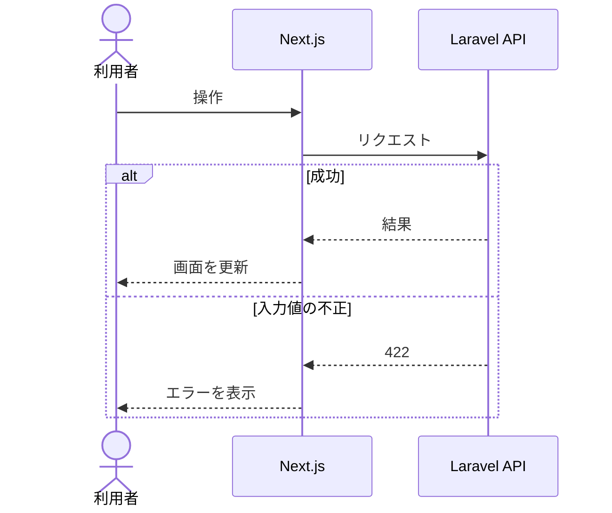

<!--
機能仕様書テンプレート
- このファイルをコピーし、`docs/specs/index.md` のファイル名に合わせて名前を変える。
- `< !-- -- >` の説明は記入後に削除する。該当しない章は「該当なし」と書く。
- 曖昧な表現（「適切に」「など」）を避け、値や条件を具体的に書く。
- 画面・API・テーブルの詳細は、それぞれ `screens.md`、`openapi.yaml`、`data-model.md` を正とし、ここには書かない。
-->

# 機能仕様書：NNN 機能名

| 項目 | 内容 |
|---|---|
| バージョン | 0.1 |
| ステータス | 下書き |
| 対応US | US-xx |
| 対象ロール | 会員 |
| 画面ID | <!-- `screens.md` の画面ID --> |

<!-- ステータスは「下書き」→「確定」。実装は「確定」になってから始める（憲章 8.3）。 -->

---

## 1. 概要

<!-- この機能で何ができるようになるかを1〜3文で。扱わないことがあれば併記する。 -->

- 扱う：
- 扱わない：

---

## 2. 振る舞い

<!--
- 利用者・Next.js・Laravel（必要なら Auth0・S3 など）の間のやりとりを書く。クラスや関数の単位までは書かない。
- 分岐は alt / opt で書く。エラー時の詳細は 5章に任せ、図では主な分岐だけにする。
-->

---

## 3. 入力とバリデーション

<!-- フロントエンド（zod）とバックエンドで同じルールを適用する。物理名は openapi.yaml に合わせる。 -->

| 項目 | 物理名 | 型 | 必須 | 制約（境界値を含めて書く） |
|---|---|---|:---:|---|
| <!-- 例：訪問日 --> | <!-- visitedOn --> | <!-- 日付 --> | <!-- ○ --> | <!-- 今日以前（日本時間）。初期値は今日 --> |

---

## 4. 業務ルール

<!--
- ドメイン層で守るルールを書く。権限（他人のデータを操作できない等）もここに書く。
- ここに書いたルールには Unit テストが必須（憲章 8.5）。
-->

| ID | ルール |
|---|---|
| BR-NNN-01 | |

---

## 5. エラー時の挙動

<!-- 共通の挙動（401 でログイン画面へ誘導、500 で共通エラー表示など）と同じなら書かなくてよい。この機能に特有のものだけ書く。 -->

| 状況 | ステータス | 利用者への表示 |
|---|:---:|---|
| | | |

---

## 6. 受け入れ基準

<!--
- requirements.md の AC を具体的なシナリオに分解する。エラー時と境界値のシナリオも含める。
- ID はテストのタイトルに含める（例：test('SC-008-03 未来の日付は登録できない')）。
- テストは Unit / E2E のどちらかを書く（architecture.md 2.4）。
-->

| ID | 対応AC | Given（前提） | When（操作） | Then（結果） | テスト |
|---|---|---|---|---|:---:|
| SC-NNN-01 | AC-xx-n | | | | E2E |

---

## 7. 未決事項

| No. | 内容 | 結論 |
|---|---|---|
| 1 | | |

---

## 改訂履歴

| バージョン | 日付 | 内容 |
|---|---|---|
| 0.1 | YYYY-MM-DD | 初版作成 |